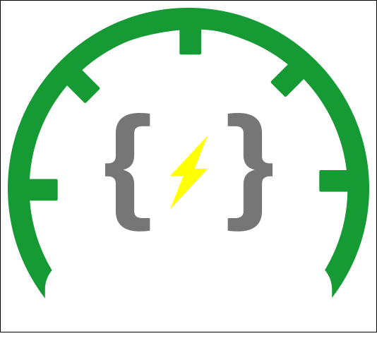
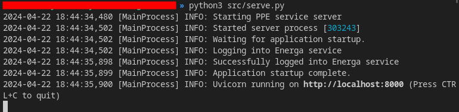

# PPEAgent




This is a Python implementation of a data scraping agent that serves a simple API
to fetch energy consumption measurements from a single meter registered
in the Energa Operator network.

The main goals of this project are:

1. Provide an isolated service that acts as a simple middleware between the
   Energa Operator API and some other application that needs to consume
   and post-process the data.
2. Slightly simplify the data structure returned by the Energa Operator API.
3. Return JSON data that is easier to consume by other applications.
4. Require as little configuration as possible to run the service.

The API is implemented using the [FastAPI] framework and served using [Uvicorn].

## Requirements

* Python 3.12+
* `fastapi==0.110.2`
* `annotated-types==0.6.0`
* `anyio==4.3.0`
* `idna==3.7`
* `pydantic==2.7.0`
* `pydantic-core==2.18.1`
* `sniffio==1.3.1`
* `starlette==0.37.2`
* `click==8.1.7`
* `h11==0.14.0`
* `httptools==0.6.1`
* `python-dotenv==1.0.1`
* `pyyaml==6.0.1`
* `uvicorn==0.29.0`
* `uvloop==0.19.0`
* `watchfiles==0.21.0`
* `websockets==12.0`
* `certifi==2024.2.2`
* `charset-normalizer==3.3.2`
* `requests==2.31.0`
* `urllib3==2.2.1`
* `configparser==7.0.0`

## Usage

There are a couple of settings that need to be configured before running the application, with the main ones being Your Energa Operator account info.

### Configuration

Below is a list of **environment variables** that control the main settings of the application run:

#### Required

* `PPE_AGENT_EMAIL` - Your Energa [*MójLicznik*] account email
* `PPE_AGENT_PASSWORD` - Your Energa [*MójLicznik*] account password

#### Optional

* `PPE_AGENT_HOST` - Hostname on which the application will listen for incoming requests (default: `'127.0.0.1'` on local deployments, `'0.0.0.0'` in Docker containers)
* `PPE_AGENT_PORT` - Port on which the application will listen for incoming requests (default: 8000)
* `PPE_AGENT_CONFIG` - path to the configuration file (default: `''` i.e. reads hardcoded defaults)

**Note**: These are the only required environment variables and are obtained by registering an account on the [*MójLicznik*] website - **not** anywhere from Your contract with Energa Operator.

#### Extra configuration

The rest of the configuration is optional and can be set in the *.cfg* file pointed to by the `PPE_AGENT_CONFIG` environment variable:

* `GENERAL_LOGGING_FORMAT` - format of log entries reported by Uvicorn (default: `'{asctime} [{processName}] {levelname}: {message}'`)
* `GENERAL_ASSETS_PATH` - path to the directory where the application will store its static assets (default: '`'assets'`' in the repository source code directory)
* `GENERAL_MAX_RETRIES` - maximum number of retries for certain operations (external requests, I/O operations etc. see the [`retry_procedure` context manager]) (default: 3)
* `AGENT_TIMEOUT` - default timeout in seconds for requests to the Energa Operator API (default: 10)
* `AGENT_ROOT_PATH` - root path of the API served by the application (default: `'/'`)

### Running the application

There are two ways to run this application: locally and in a Docker container.
The preferred way is to simply spawn a Docker container, as it requires less
configuration and corresponds to the intended use case of this application.

However, if you want to run the application locally (e.g. for quick testing or modification purposes), both methods are described below.

#### Local installation

To install the required dependencies **locally**, run:

```shell
pip install -r requirements.txt
```

Next, simply spawn a Uvicorn ASGI server by running the `serve.py` script:

```shell
python serve.py
```

This should result in a new Uvicorn process spawning in the terminal as so:



#### Docker image

A more pro-Gamer move :joystick: is to deploy this application in a Docker container.

This repository provides a [Dockerfile] that installs the required dependencies and sets up the application to run in a container.

To build the Docker image, run the following command in the repository root directory:

```bash
docker build -t "<IMAGE NAME>" .
```

**But** there is an even more sophisticated approach - the official image is available on Docker Hub, so you can pull it directly from there:

```bash
docker pull kokosz/ppe-agent
```

After building the image or pulling it from Docker Hub, you can run the container by executing the following command:

```bash
docker \
    run \
        -p 8000:8000 \ 
        --volume \
            "<PATH TO YOUR CONFIG FILE>:/app/config.cfg" \
        --env \
            PPE_AGENT_CONFIG="/app/config.cfg" \
        --env \
            PPE_AGENT_EMAIL="<YOUR EMAIL FOR MOJLICZNIK>" \
        --env \
            PPE_AGENT_PASSWORD="<YOUR PASSWORD FOR MOJLICZNIK>" \
        --env \
            PPE_AGENT_PORT=8000 \
        kokosz/ppeagent
```

Note that You can omit the volume mount of the custom configuration file if you don't need it and leave the `PPE_AGENT_CONFIG` environment variable empty.

**Hint**: If you want to test out passing the configuration file to the container, you can use the provided `example.cfg` file in the repository root directory.
Be sure to run the Docker container from the repository root path (there are some relative paths in the configuration file). 😉

[FastAPI]: https://fastapi.tiangolo.com/
[Uvicorn]: https://www.uvicorn.org/
[*MójLicznik*]: https://mojlicznik.energa-operator.pl/
[`retry_procedure` context manager]: https://github.com/kamilrybacki/PPEAgent/blob/main/src/agent/utils/retry.py
[Dockerfile]: https://github.com/kamilrybacki/PPEAgent/blob/main/Dockerfile
